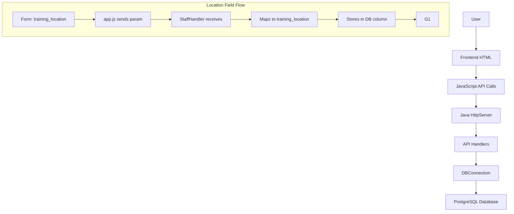

# Ultimate Driving School Java Project - Rewrite Plan

## Executive Summary

This document outlines a comprehensive plan to rewrite the Ultimate Driving School Java project with a working database, proper backend-frontend integration, and consistent column naming throughout the system.

## Current Issues Identified

### 1. Column Naming Inconsistency

| Table | Column | Issue |
|-------|--------|-------|
| `users` | `location` | User's base location |
| `applications` | `location` | General location field (unused/duplicate) |
| `applications` | `training_location` | Where applicant will receive training |

**Problem**: The `applications` table has both `location` and `training_location` columns, causing confusion in data flow.

### 2. Backend Issues

- **DBConnection.java**: Methods inconsistently reference `location` vs `training_location`
- **StaffHandler.java**: Uses `training_location` parameter but may map incorrectly
- **UltimateServer.java**: Creates tables with both columns, no data migration

### 3. Data Flow Issues

1. Frontend sends `training_location` in form submissions
2. Backend receives it but may store in wrong column
3. Queries filter by wrong column, returning incomplete data

## Solution Architecture

### Standardized Column Naming

```
users table:
  - location: User's assigned branch/location (for staff)

applications table:
  - training_location: Where the student will receive training (for applicants)
```

### Database Schema

```sql
-- Drop and recreate with clean schema
DROP DATABASE IF EXISTS ultimate_driving_school;
CREATE DATABASE ultimate_driving_school;
\c ultimate_driving_school;

-- Users table
CREATE TABLE users (
    id SERIAL PRIMARY KEY,
    email VARCHAR(255) UNIQUE NOT NULL,
    password_hash VARCHAR(255) NOT NULL,
    full_name VARCHAR(255) NOT NULL,
    phone VARCHAR(50),
    role VARCHAR(50) DEFAULT 'applicant',
    location VARCHAR(255),  -- Staff's assigned branch
    created_at TIMESTAMP DEFAULT CURRENT_TIMESTAMP,
    updated_at TIMESTAMP DEFAULT CURRENT_TIMESTAMP
);

-- Courses table
CREATE TABLE courses (
    id SERIAL PRIMARY KEY,
    name VARCHAR(255) NOT NULL,
    description TEXT,
    duration VARCHAR(100),
    price DECIMAL(10,2),
    requirements TEXT,
    created_at TIMESTAMP DEFAULT CURRENT_TIMESTAMP
);

-- Applications table
CREATE TABLE applications (
    id SERIAL PRIMARY KEY,
    user_id INTEGER REFERENCES users(id) ON DELETE SET NULL,
    first_name VARCHAR(100) NOT NULL,
    last_name VARCHAR(100) NOT NULL,
    email VARCHAR(255) NOT NULL,
    phone VARCHAR(50) NOT NULL,
    date_of_birth DATE,
    address TEXT,
    city VARCHAR(100),
    postal_code VARCHAR(20),
    id_number VARCHAR(50),
    license_type VARCHAR(50) DEFAULT 'Class B',
    course_id INTEGER REFERENCES courses(id) ON DELETE SET NULL,
    driving_course VARCHAR(100),
    computer_course VARCHAR(100),
    training_location VARCHAR(255),  -- CONSISTENT: Only this column
    transmission VARCHAR(50),
    preferred_schedule DATE,
    emergency_contact_name VARCHAR(255),
    emergency_contact_phone VARCHAR(50),
    comments TEXT,
    mpesa_message TEXT,
    medical_conditions TEXT,
    previous_driving_experience BOOLEAN DEFAULT false,
    status VARCHAR(50) DEFAULT 'pending',
    school_fees DECIMAL(10,2) DEFAULT 0.00,
    fees_paid DECIMAL(10,2) DEFAULT 0.00,
    fees_balance DECIMAL(10,2) DEFAULT 0.00,
    payment_status VARCHAR(50) DEFAULT 'unpaid',
    payment_method VARCHAR(50),
    staff_id INTEGER REFERENCES users(id) ON DELETE SET NULL,
    created_at TIMESTAMP DEFAULT CURRENT_TIMESTAMP,
    updated_at TIMESTAMP DEFAULT CURRENT_TIMESTAMP
);

-- Contact messages table
CREATE TABLE contact_messages (
    id SERIAL PRIMARY KEY,
    name VARCHAR(255) NOT NULL,
    email VARCHAR(255) NOT NULL,
    phone VARCHAR(50),
    subject VARCHAR(255),
    message TEXT NOT NULL,
    status VARCHAR(50) DEFAULT 'new',
    created_at TIMESTAMP DEFAULT CURRENT_TIMESTAMP,
    updated_at TIMESTAMP DEFAULT CURRENT_TIMESTAMP
);

-- M-Pesa messages table
CREATE TABLE mpesa_messages (
    id SERIAL PRIMARY KEY,
    application_id INTEGER REFERENCES applications(id) ON DELETE SET NULL,
    user_id INTEGER REFERENCES users(id) ON DELETE SET NULL,
    message TEXT NOT NULL,
    phone VARCHAR(50),
    amount DECIMAL(10,2) DEFAULT 0.00,
    mpesa_code VARCHAR(50),
    status VARCHAR(50) DEFAULT 'pending',
    verified BOOLEAN DEFAULT false,
    verified_by INTEGER REFERENCES users(id) ON DELETE SET NULL,
    verified_at TIMESTAMP,
    raw_message TEXT,
    transaction_type VARCHAR(50),
    transaction_time TIMESTAMP,
    created_at TIMESTAMP DEFAULT CURRENT_TIMESTAMP
);

-- JWT tokens table
CREATE TABLE jwt_tokens (
    id SERIAL PRIMARY KEY,
    token VARCHAR(500) NOT NULL,
    user_id INTEGER REFERENCES users(id) ON DELETE CASCADE,
    expires_at TIMESTAMP NOT NULL,
    created_at TIMESTAMP DEFAULT CURRENT_TIMESTAMP,
    UNIQUE(token)
);
```

## Implementation Tasks

### Task 1: Fix database.sql

**File**: `Java_project/Ultimate/database.sql`

**Changes**:
1. Remove duplicate `location` column from applications table
2. Keep only `training_location` column
3. Add proper indexes for performance
4. Include sample data with consistent location values

### Task 2: Fix DBConnection.java

**File**: `Java_project/Ultimate/DBConnection.java`

**Changes**:
1. Review all methods using `location` vs `training_location`
2. Ensure `getAllLocations()` returns consistent data
3. Ensure `updateApplicationLocation()` uses correct column name
4. Add data migration method for existing databases
5. Fix `getApplicationsByLocation()` to use `training_location`

### Task 3: Fix StaffHandler.java

**File**: `Java_project/Ultimate/StaffHandler.java`

**Changes**:
1. Line 358: Ensure `training_location` parameter is used consistently
2. Update `handleUpdateLocation()` to map `training_location` correctly
3. Update `handleUpdateProfile()` to use correct column names
4. Ensure all location-related queries use consistent naming

### Task 4: Fix ApplicationHandler.java

**File**: `Java_project/Ultimate/ApiHandler.java` (contains ApplicationHandler)

**Changes**:
1. Ensure application submission uses `training_location`
2. Fix query methods to filter by `training_location`
3. Update application retrieval to include correct location field

### Task 5: Fix Other Handlers

**Files**:
- `UserHandler.java` - Ensure user location handling is correct
- `ContactHandler.java` - No changes needed (no location field)
- `CourseHandler.java` - No changes needed (no location field)
- `JWTUtil.java` - No changes needed (token utility only)

### Task 6: Update app.js

**File**: `Java_project/Ultimate/web/js/app.js`

**Changes**:
1. Verify `training_location` is sent in form submissions
2. Ensure location filtering uses correct API parameters
3. Test API integration with updated backend

### Task 7: Update HTML Frontend Files

**Files**:
- `staff.html` - Verify location dropdown uses correct field
- `admin.html` - Verify location filtering works
- `dashboard.html` - Verify user location display

**Changes** (if needed):
1. Update form field names to use `training_location`
2. Verify location selectors match backend expectations

### Task 8: Test Compilation

**Steps**:
1. Clean and compile Java files:
   ```bash
   cd Java_project/Ultimate
   javac -cp ".;postgresql-42.7.8.jar" *.java
   ```
2. Run database migration script
3. Start server and test endpoints

### Task 9: Document Setup Instructions

**File**: `Java_project/Ultimate/README.md`

**Contents**:
1. Prerequisites (Java, PostgreSQL)
2. Database setup steps
3. Compilation instructions
4. Running the server
5. Testing checklist
6. Known issues and solutions

## Data Flow Diagram



## API Endpoints

| Method | Endpoint | Description | Parameters |
|--------|----------|-------------|------------|
| POST | /api/auth/register | Register new user | email, password, full_name, phone |
| POST | /api/auth/login | Login user | email, password |
| GET | /api/auth/me | Get current user | Authorization header |
| POST | /api/applications | Submit application | training_location, course details |
| GET | /api/applications | Get user's applications | Authorization header |
| GET | /api/staff/location-students | Get students by location | location param |
| PUT | /api/staff/application/location | Update student location | application_id, training_location |

## Testing Checklist

- [ ] Database schema created without errors
- [ ] Java compilation successful
- [ ] Server starts without errors
- [ ] User registration works
- [ ] User login works
- [ ] Application submission includes training_location
- [ ] Staff can view students by location
- [ ] Admin can filter by location
- [ ] M-Pesa message processing works
- [ ] JWT authentication works
- [ ] Mobile responsive design works

## Rollback Plan

If issues occur:
1. Backup current database: `pg_dump -U postgres -d ultimate_driving_school > backup.sql`
2. Keep original files in `Java_project/Ultimate/backup/`
3. Document any custom changes before applying fixes

## Timeline

This is a step-by-step rewrite. Each task should be completed and tested before moving to the next one. The goal is to have a fully working system with:
- Consistent column naming
- Proper data flow
- All features working correctly
